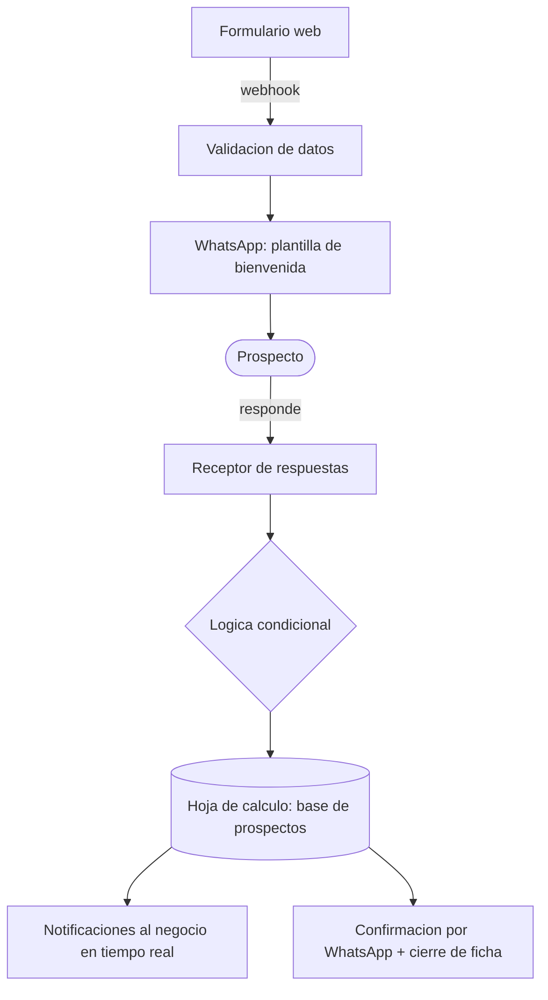
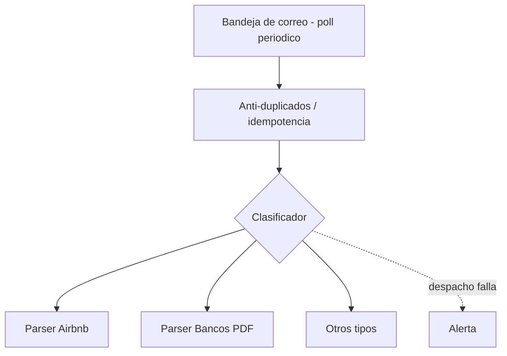
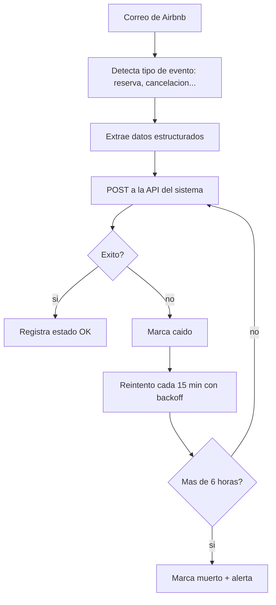
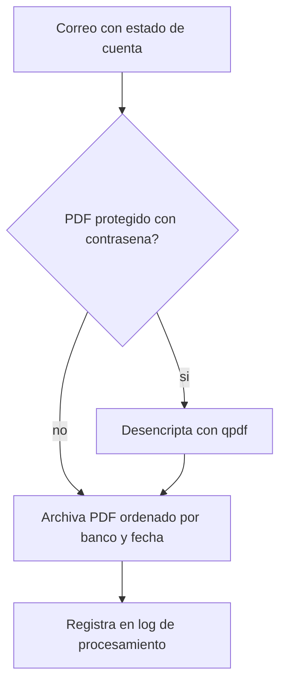
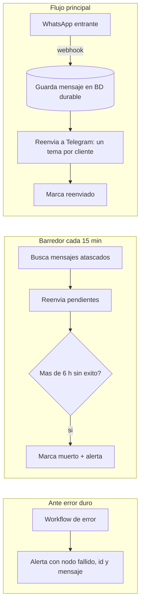

## Que es

Cinco automatizaciones construidas sobre **n8n**, cada una resolviendo un ciclo completo de negocio sin intervencion manual. Corren en produccion sobre infraestructura propia; lo que comparten no es el canvas bonito sino los patterns de resiliencia: idempotencia, reintentos con backoff, y alertas cuando algo se muere de verdad.

## 1. Encuesta + captacion de prospectos por WhatsApp

Formulario web que contacta al prospecto por WhatsApp, lo califica con logica condicional y guarda todo en una hoja de calculo (3 modulos encadenados).

**Stack:** n8n · WhatsApp Business API · Webhooks · Google Sheets · Notificaciones

## 2. Clasificador de correo entrante

Clasifica todos los correos entrantes y los rutea al parser correcto de forma asincrona, con anti-duplicados y alertas ante fallo.

**Stack:** n8n · Gmail · Ruteo polimorfico · Despacho asincrono · Alertas

## 3. Parser de correos de Airbnb

Lee correos de Airbnb, extrae datos de reservas y eventos y los postea a una API, con reintentos automaticos por backoff si algo falla.

**Stack:** n8n · Gmail · Parsing estructurado · API REST · Reintentos con backoff

## 4. Parser de estados de cuenta bancarios (PDF)

Recibe estados de cuenta bancarios, desencripta los PDFs protegidos con contrasena y los archiva ordenados por banco y fecha.

**Stack:** n8n · Gmail · qpdf · Almacenamiento en disco · Logging

## 5. Puente WhatsApp a Telegram (auto-sanador)

Reenvia mensajes de WhatsApp a Telegram organizados por cliente; rescata mensajes atascados cada 15 minutos y alerta ante errores duros.

**Stack:** n8n · WhatsApp Business API · Telegram · BD durable · Recuperacion automatica

## Patrones tecnicos que comparten

- **Resiliencia:** reintentos con backoff, deduplicacion y recuperacion automatica.
- **Observabilidad:** alertas en tiempo real ante cualquier fallo.
- **Integracion:** webhooks, APIs REST y mensajeria (WhatsApp / Telegram).
- **Persistencia:** cada evento queda registrado con su estado actualizado.

La regla de diseno detras de los cinco: un workflow que no avisa cuando falla no es una automatizacion, es una bomba de tiempo. Todo flujo tiene un camino de error explicito y un mecanismo de rescate para lo que se atora.
