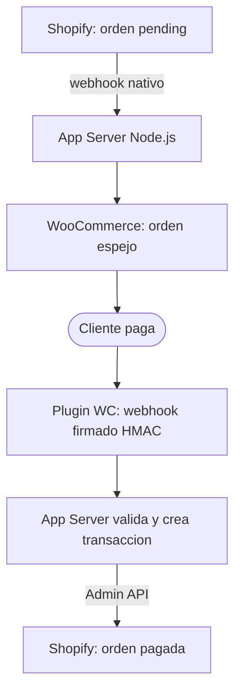
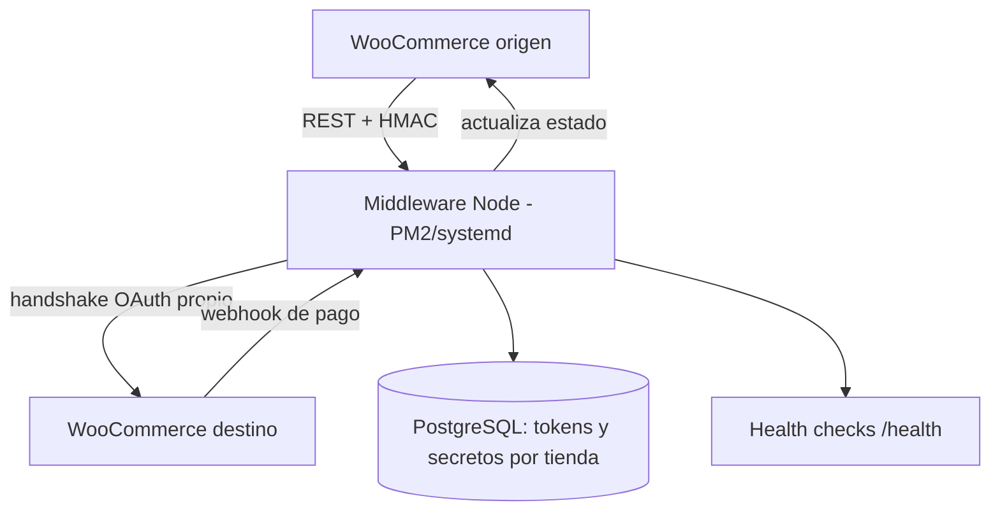

## Que es

Experiencia de produccion construyendo y operando integraciones de comercio electronico para una agencia con clientes en Europa: plugins de WooCommerce escritos a la medida, apps y extensiones de Shopify, bridges bidireccionales entre plataformas y pasarelas de pago reales (Stripe y RedSys de Espana). Sistema privado; aqui van la arquitectura y los patterns.

## Bridge Shopify a WooCommerce

El nucleo: una orden nace en Shopify, se cobra en WooCommerce y Shopify se entera solo.

Dos piezas construidas desde cero (~1,500 lineas combinadas):

- **App de Shopify** (Node.js + TypeScript + Express): OAuth, recepcion de webhooks, Shopify Admin API para crear transacciones, sincronizacion de metafields via GraphQL.
- **Plugin de WooCommerce** (PHP 8): endpoints REST propios, validacion HMAC-SHA256 en ambas direcciones, compatibilidad HPOS (WooCommerce 8+), panel de configuracion en el admin, reintentos automaticos y logging.

## Plugins de WooCommerce a la medida

No configuracion de plugins de terceros: desarrollo de plugins propios con gateway de pago custom, paginas de ajustes en el admin de WordPress, hooks del ciclo de vida de la orden y versionado propio (v1.x a v2.x en produccion con tiendas activas). Actualizaciones desplegadas sobre flota en operacion sin downtime.

## Extensiones y apps de Shopify con Shopify CLI

- **Checkout UI Extension**: boton de pago en la thank-you page, configurable desde el editor de Shopify, con la URL de destino sincronizada como metafield via GraphQL. Desplegada con Shopify CLI y traducida a 7 idiomas.
- **Apps custom vs apps de Partner**: migracion del modelo legacy (app vinculada a una sola tienda) al modelo de Partner Dashboard con OAuth, instalable en multiples tiendas de clientes.

## Shopify Partners: vinculacion de clientes y permisos

Gestion del ciclo completo en el portal de Partners: creacion de apps, definicion de scopes minimos por funcionalidad, flujo OAuth de instalacion en tiendas de clientes, rotacion de credenciales y altas/bajas de tiendas vinculadas. Cada tienda opera con sus propios tokens y secretos; nada compartido entre clientes.

## Variante WooCommerce a WooCommerce con middleware

Para escenarios donde ambos extremos son WooCommerce, un middleware Node propio conecta las dos instancias:

Multi-tenant real: cada par de tiendas tiene sus credenciales aisladas en PostgreSQL, con fallback controlado y health checks consultables.

## Pasarelas de pago: Stripe y RedSys

- **Stripe**: configuracion y validacion de cobro en produccion sobre WooCommerce.
- **RedSys (Espana)**: la parte dificil no fue integrarla sino operarla — los callbacks de notificacion de RedSys eran bloqueados por el proxy de Cloudflare y los pagos quedaban "pendientes" con el dinero ya cobrado. Diagnostico con logs de ambos lados, identificacion del ASN de RedSys, reglas de firewall especificas en Cloudflare y manejo fino del proxy por registro DNS. Pattern reutilizable para cualquier pasarela con callbacks server-to-server detras de proxy.

## Aprovisionamiento 1-click y operacion de flota

Levantar una tienda nueva paso de 4 pasos manuales a 1 comando:

- **wp-cli** para instalar y autoconfigurar WordPress + WooCommerce (HPOS incluido), generar secretos de webhook y activar el plugin.
- **Cloudflare API** para DNS y certificados (incluido el ciclo DNS-only, emision Let's Encrypt, proxy on).
- Scripts de deploy y restore repetibles, y tests E2E automatizados que validan el ciclo completo orden-pago-confirmacion antes de entregar.
- Operacion sobre VPS propios: Nginx, PM2, WireGuard entre servers, backups automatizados a Wasabi, hardening con UFW y Fail2ban.

## Patrones que me llevo

- **Firmar todo**: HMAC en cada webhook, en ambas direcciones; el que no firma, no entra.
- **Idempotencia y reintentos**: los webhooks de pago se pierden y se duplican; el sistema asume ambas cosas.
- **El proxy es parte del sistema de pagos**: si Cloudflare (o cualquier WAF) esta enfrente, los callbacks de la pasarela son trafico que hay que permitir explicitamente, no un detalle.
- **Aprovisionamiento como codigo**: si montar una tienda requiere pasos manuales, la flota no escala.
